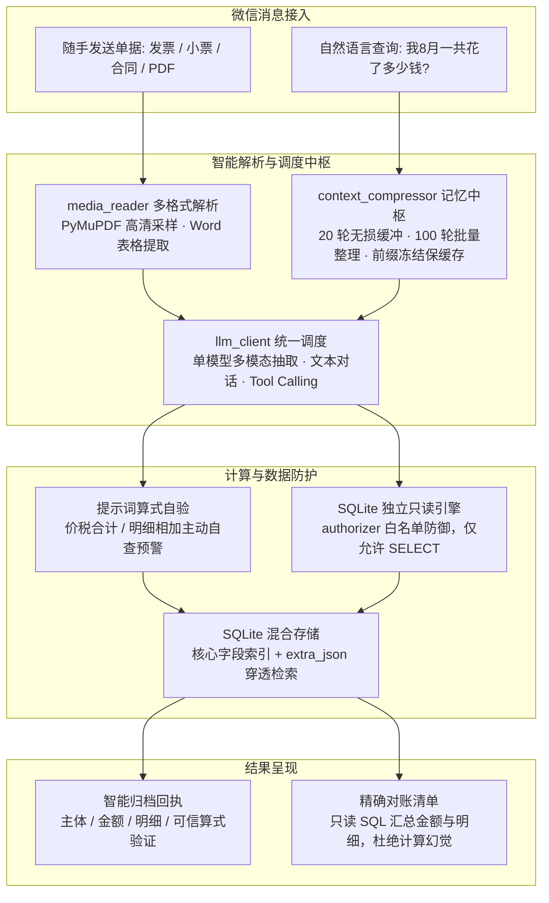

# 个人单据整理助手 (WeChat Receipt Agent)

> **把「随手拍一张单据」变成「自动记账、随时查账」。**
> 在微信里发一张发票、小票或合同照片，它自动读懂并结构化归档；之后直接问
> 「我 8 月一共花了多少钱？都有哪些单据？」，它用 SQL 算出准确答案并列出清单。

**这是什么**：一个跑在自己电脑上的微信机器人。收到的不是规整的表格，而是手机随手拍的
照片、多页 PDF、Word 合同——它负责看懂、归档、对账。

**解决什么问题**：把凭据整理从"手动往 Excel 里抄"变成"发一张图"。金额统计一律由数据库
算，不让大模型做算术（算术幻觉是这类应用最常见的坑）。

**做到什么程度**：覆盖 9 类常见单据、图片/多页 PDF/Word/纯文本 4 类格式（含 iPhone 的
HEIC 原图），**25 项自动化测试全绿**，自带 6 份样例单据可直接体验，也带一个网页控制台
（填 API Key、扫码绑定，不用手改配置文件）。

> 本文管「这是什么、怎么跑起来」。部署到服务器之后的事（常驻、扫码隧道、排查）见
> [`服务器部署.md`](服务器部署.md)。

---

## 一、它实际长什么样（真实输出，非示意图）

项目自带 6 份样例单据（`samples/`），下面是把样例灌进库之后的**真实交互输出**。

### 1. 发一张发票照片

```text
已归档 · 发票
上海晨光办公用品有限公司开的电子普票，开票日期 2026-08-18，价税合计 1130.00 元。
明细：办公用品，不含税 1000.00 元，13% 税 130.00 元。
账目核验：1000.00 + 130.00 = 1130.00，与价税合计一致。
发票号码 02514789。
```

### 2. 发一张消费小票（明细加总校验）

```text
已归档 · 小票/收据
某某餐饮有限公司消费小票，合计 88.50 元，日期 2026-08-15 12:41。
明细：宫保鸡丁 58.00、米饭 6.00、可乐 24.50，明细加总正好 88.50，账目核验一致。
单号 NO.20260815-0371。
```

### 3. 问一句「我 8 月一共花了多少钱？都有哪些单据？」

```text
8 月共归档 6 张单据，合计 ¥173,420.50：

| 日期  | 单据类型            | 对方主体     | 金额        |
|:------|:--------------------|:-------------|:------------|
| 08-01 | 机械设备采购合同    | 某某机械制造 | ¥120,000.00 |
| 08-12 | 螺纹钢送货单        | 某某建材     | ¥51,250.00  |
| 08-18 | 办公用品采购发票    | 上海晨光     | ¥1,130.00   |
| 08-22 | 淘宝订单-机械键盘   | 罗技旗舰店   | ¥399.00     |
| 08-05 | 高铁客票 北京南→上海 | 中国铁路     | ¥553.00     |
| 08-15 | 餐饮消费小票        | 某某餐饮     | ¥88.50      |

💡 统计提示：其中 12 万元合同与 5.1 万元送货单属于工程采购类款项；若仅统计个人日常消费开销，合计为 ¥2,170.50。
```

> 最后那句提示不是写死的规则，是模型读懂了"合同/送货单"和"个人消费"的区别后自己给的补充。

---

## 二、核心能力与关键取舍

每条先说做到了什么，再说为什么这么做。

**多格式、多类型**
图片（含 iPhone 的 HEIC）、多页 PDF、Word（含合同内嵌表格）、纯文本；自动区分发票 / 小票 / 合同 / 送货单 / 车票行程单 / 对账单 / 保单 / 报销单 / 订单等 9 类。

**金额不让模型算**
汇总、筛选、按月/按类型统计全部交给数据库的 SQL 聚合，模型只负责读懂和表达。单据上的算式（不含税＋税额＝价税合计、明细相加＝总计）在抽取时当场验一遍，对不上就在回执里说明。

防御落在 SQLite 的**独立只读连接**上——文件级 `mode=ro` 加 `authorizer` 动作白名单（只放行 SELECT / READ / FUNCTION）。模型即使被单据里的文字诱导生成 `DROP`/`ATTACH`/`PRAGMA`，也会在执行层被拒绝，**不依赖关键字黑名单**。写操作只留两个窄接口（按编号改、按编号删），SQL 语句由程序写死，模型只能给参数。

**长会话不失忆也不变啰嗦**
最近 20 轮对话逐字保留（"那张发票""上一笔"能指得到），攒够 100 轮**整批**移出提示词，但全部落库随时可查；单据本身存在数据库里，不堆在对话中。三处取舍：

- **不做 LLM 摘要**：模型会把自己编的摘要当成事实，不准确且会污染提示词。改成"整批移出 + 全量留底"。
- **整批移出，而不是每轮滑动一格**：这样两次整理之间的请求前缀逐字节不变，服务端的前缀缓存因此持续命中，只有整理那一次会失效——比每轮滑动省一个数量级的开销。
- **单位按"轮"计**（一轮 = 一条用户消息及其回复），不按"消息条数"：每次工具调用也会落一条消息，按条数算会把窗口挤到只剩 4~14 轮，还会切出"有回复、没提问"的孤儿消息。有一组测试专门钉住这一点。

命中率不用信这里——控制台日志里每条消息都会打印 `缓存命中=N(百分比) 上下文=N 轮`。

**能改也能删**
用户说"金额记错了，是 1200"或"把那张删掉"，模型会真的去改/删，而不是只口头答应；改删之前先确认是哪一条。

**不编数据**
单据日期读不到就留空，**不拿今天顶上**（事后看不出是猜的）；抽取两遍读不出结构化信息就拒绝入库，而不是塞一条"金额 0、品目是文件名"的垃圾记录。

**疑似重复只提示、不自动合并**
同一笔消费可能同时有团购截图、支付截图和正规发票，三者金额与主体名往往并不一致；规则匹配不到时宁可返回空，也不靠模型猜——**误合并比不合并危害更大**。程序侧还会提醒模型看不见的问题（日期/主体缺失、库里已有很接近的记录），由模型决定怎么跟用户说。

**单模型统一调度**
同一个模型同时承担多轮对话、工具调用（Tool Calling）与图片/PDF 视觉抽取。少维护一套模型、少一半网络开销，代价是要选一个"同时具备视觉与函数调用能力"的模型（当前用 `deepseek-flash`）。

**网络容灾**
限流与网关抖动按可重试状态码分级退避重试；4xx 这类请求本身的问题不重试。

**开箱即用**
网页控制台里填 API Key、扫码绑定，不需要手改配置文件；带环境自检脚本（模型连通性、数据库、微信进程）和 6 份样例单据。

### 它不做什么（同样重要）

- 不做多用户、不做权限体系——这是**单个用户自己用**的工具；
- 不做 LLM 摘要式记忆（理由见上）；
- 不做财务合规意义上的审计——它保证的是"算得准"，不是"可入账"。

---

## 三、系统架构与数据流

遵循 **"模型负责识别与理解、程序负责存储与校验、SQL 负责精确计算"** 的职责分离：
模型不碰算术，程序不给 SQL 之外的写权限。



---

## 四、环境安装与快速启动

### 1. 环境准备
- **Python**: 3.10 或更高版本
- **Node.js**: 18.0 或更高版本（微信协议接入所需）
- **Git**

### 2. 克隆项目与安装依赖

```bash
git clone https://github.com/ls18166407597-design/wechat-receipt-agent.git
cd wechat-receipt-agent

python3 -m venv venv
source venv/bin/activate          # Windows 用户: venv\Scripts\activate

pip install -r requirements.txt   # Python 后端依赖
npm install                       # Node.js 依赖（微信协议接入）
```

### 3. 配置模型 API Key

两种方式任选：
- **方式 A（推荐）**：先跳到下一步启动服务，在自动打开的 Web 控制台里填入 `API Key`，
  点【保存配置】即热生效，不碰文件；
- **方式 B**：`cp .env.example .env`，编辑填入 `OPENAI_API_KEY`。

> `.env` 只放三样东西：API Key、接口地址、模型名（这三样因部署而异、且密钥不能进仓库）。
> 其余参数一律写在 `core/config.py` 里——**一个值只有一个家**，省得改了不生效还不知道。

### 4. 一键启动

```bash
python3 start.py
```

终端会拉起服务并自动打开控制台（`http://127.0.0.1:8765`）：

1. **扫码绑定**：用微信扫网页右侧的动态二维码，完成机器人登录绑定；
2. **随手记账**：向机器人发任意发票图片、消费小票、合同 PDF 或 Word 文档即可。

> 扫码页等于机器人的绑定入口，**谁拿到链接谁就能绑**，所以默认只监听本机回环。

### 5. 快速验证

```bash
# 1. 灌入 6 份样例单据（库非空时会跳过，重置演示数据必须带 --reset）
python3 seed_demo_data.py --reset

# 2. 环境自检（模型连通性、数据库、微信进程）
python3 doctor.py

# 3. 全套 25 项自动化测试（含只读 SQL 安全、记忆窗口口径、备份完整性）
pytest tests/ -v
```

---

## 五、目录结构

```text
wechat-receipt-agent/
├── start.py                  # 一键启动器（拉起控制台并自动打开浏览器）
├── core/                     # 核心业务引擎
│   ├── config.py             # 系统参数配置（唯一的调参入口）
│   ├── db.py                 # SQLite 存储与只读白名单连接
│   ├── llm_client.py         # 大模型 API 客户端（带退避重试）
│   ├── media_reader.py       # 多格式凭证加载（图片/PDF/Office/文本）
│   ├── pdf_processor.py      # 多页 PDF 取样与高清渲染
│   ├── context_compressor.py # 上下文窗口与批量整理（按轮计）
│   ├── native_tools.py       # 只读检索/统计与受限写接口
│   └── agent_runner.py       # Agent 调度运行中枢
├── web/
│   └── server.py             # 本地 Web 控制台（配置管理与扫码配对）
├── samples/                  # 单据样例生成脚本与合成样张
├── tests/                    # 25 项自动化单元与集成测试
├── seed_demo_data.py         # 演示数据初始化工具
├── doctor.py                 # 运行环境一键自检工具
├── wechat_bot.js             # 微信协议接入桥接
├── wx_send.js                # 微信文字回复（补上 SDK 丢掉的下行失败）
└── requirements.txt          # Python 核心依赖清单
```

---

## 六、技术边界说明

- **文档格式支持**：JPG/PNG/WEBP/BMP/HEIC 图片、多页 PDF、Word（.docx，提取正文段落及
  合同内嵌表格）及纯文本；**独立电子表格（.xlsx / .xls / .csv）会被明确拦截报错**——那是
  多行数据库流水，不是单张单据，硬塞进来只会产出错的账；
- **多页 PDF 处理策略**：短文档全量解析；超长合同默认只读前 3 页，并在回执里**如实说明
  核验范围**（"这份文档共 12 页，只读了第 1、2、3 页"），不假装看全了；
- **交互通道特性**：只发文字。用户索要原件时如实说明并提供检索信息，不会说"已经发给你了"；
- **已知简化**：单用户单会话；微信协议接入依赖第三方开源 SDK，可用性随上游变化。

---

## 七、License

未声明。个人项目，欢迎提 issue 交流；如需引用请先开 issue 说明用途。
